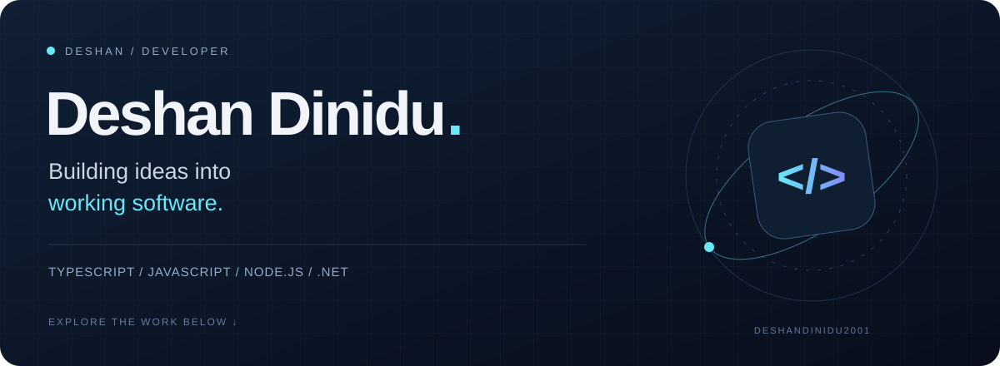
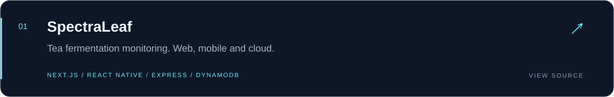
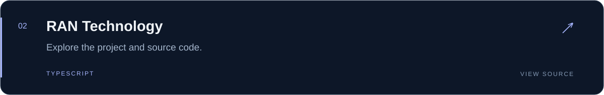
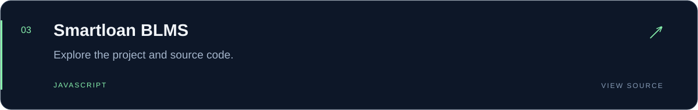
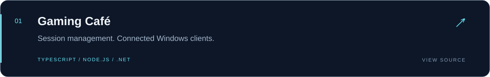

  

  <a href="#selected-work">Selected work</a> &nbsp; / &nbsp;
  <a href="#toolkit">Toolkit</a> &nbsp; / &nbsp;
  <a href="https://github.com/deshandinidu2001?tab=repositories">All repositories ↗</a>

## A little about me

Hi, I'm **Deshan**. I build across web, mobile, and backend systems with TypeScript and JavaScript. I'm part of the **SpectraLeaf** team, developing an IoT-based tea fermentation monitoring project with web and mobile applications.

I enjoy turning ideas into practical software, connecting interfaces to the systems behind them, and learning through building.

## Education

**University of Peradeniya, Sri Lanka**  
Faculty of Engineering · Department of Computer Engineering

**Degree programme:** Bachelor of the Science of Engineering Honours (BScEngHons) — Computer Engineering  
**Batch:** E21

[View my university profile ↗](https://people.ce.pdn.ac.lk/students/e21/054/)

## Selected work

<strong>Explore SpectraLeaf · team project</strong>

An IoT-based project for monitoring tea fermentation and recording batch profiles, bringing together web dashboards, mobile applications, and backend services.

- **Web:** React, Next.js and TypeScript
- **Mobile:** React Native and Expo
- **Backend:** Node.js and Express
- **Cloud and data:** AWS SDK, DynamoDB and Amplify

[Explore the repository →](https://github.com/cepdnaclk/e21-3yp-SPECTRA-LEAF)

 

 

 

<strong>Explore the gaming café system</strong>

A client-server project for managing gaming café sessions. The Node.js server manages timers and sends lock/unlock commands to Windows clients over TCP using JSON messages.

- **Server:** Node.js and TypeScript
- **Client:** .NET 8
- **Communication:** TCP / JSON, with client reconnection

[Explore the code →](https://github.com/deshandinidu2001/game-cafe-new)

## Toolkit

Technologies I work with across my individual and team projects:

**Languages**

  
  

**Web & UI**

  
  
  
  

**Mobile & backend**

  
  
  
  
  

**Cloud & data**

  
  
  

<strong>More from my workbench</strong>

- [Peraverse Kiosk](https://github.com/deshandinidu2001/Peraverse_Kiosk-main) — another JavaScript project.
- [Browse all my repositories](https://github.com/deshandinidu2001?tab=repositories)
- [See my GitHub activity](https://github.com/deshandinidu2001?tab=overview)

---

IDEAS → CODE → SOMETHING USEFUL <a href="https://github.com/deshandinidu2001">Find me on GitHub ↗</a>

